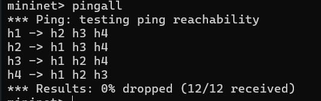

# Network Security and Firewall Assignment Report

## 1. Introduction
- This report documents my results when implementing a simple firewall using Mininet.
- The primary goal was to allow ICMP and ARP traffic while blocking all other traffic types, minimizing the network exposure and improving security.
---

## Setting up environment and modifying Topo1.py
- After setting up the environment with virtualbox and vagrant I tested that mininet was working by running topo1.py and testing pingall.
- I then modified topo1.py to include 4 hosts connected to a server, a basic topology.
- I then ran multiple commands which you can see the results for below.
---
### Terminal output of h1 ping h4

---

### Terminal output of iperf h1 h4

---

### Terminal output of Dump

---

### Terminal output of Pingall

---

### l2_learning.py
- The l2_learning.py script implements a basic Layer 2 learning mechanism for OpenFlow switches, allowing them to learn the MAC addresses of connected hosts and forward packets accordingly. When h1 pings h4, the switch learns h1's MAC address and the port it is connected to, flooding the ping request if h4's MAC address is not yet in the table. If the switch has learned h4's MAC address, it will forward the ICMP request directly to h4's port. Consequently, h2 should not receive the ICMP packet if the switch has correctly learned the MAC addresses; however, if h4 is unknown to the switch, it may receive the packet temporarily during the flooding process until the switch learns the correct paths.
---
### When you run h1 ping h4 is there any chance you receive an ICMP packet in h2?
- There is not a chance for h2 to receive an ICMP packet when there is a firewall present with proper rules. However before the firewall is up there is a chance that h2 receives an ICMP packet if there is any packet flooding and some packets reach the unintended hosts.

--- 
## Modifying the firewall controller and topo2.py
- The last part of the assignment was to finally design the firewall as per the rules below.

| Source IP   | Destination IP | Protocol | Action |
|-------------|----------------|----------|--------|
| any ipv4    | any ipv4       | icmp     | accept |
| any         | any            | arp      | accept |
| any ipv4    | any ipv4       | -        | drop   |

- I first commented out the static ARP configuration line in topo2.py.
- I then used the skeleton code in exe1-controller.py along with OpenFlow Tutorials to create the firewall with the specified rules successfully as tested here below. 

### 4.1 Ping Test (pingall)
- **Test Objective**: To verify if the firewall correctly handles ICMP and ARP traffic, while dropping all other traffic types.
- **Test Execution**: The `pingall` command was run within Mininet to test connectivity among all hosts.
- **Expected Outcome**:
  - Hosts should be able to ping each other only when ICMP packets are allowed by the firewall.
  - ARP packets should be exchanged between all hosts, enabling address resolution.
  - Other types of packets should be dropped, with limited communication among hosts.
- **Results**: The expected behavior was observed, with ICMP and ARP packets allowed and all other traffic blocked.

  
  
---

### 4.2 Flow Table Inspection
- **Objective**: To verify that the firewall rules were correctly installed in the switch's flow table.
- **Execution**: The `dpctl dump-flows` command was used to inspect the flow entries in the switch.
- **Expected Outcome**: The flow table should show entries that accept ARP and ICMP traffic while dropping all other traffic by default.

---

## 6. Conclusion
- **Summary**: The firewall was successfully implemented, allowing ICMP and ARP traffic while blocking other traffic types.
- **Challenges**: The biggest challenge was the setup of the environment, it proved tedious as I had to install certain version of virtualbox, make super hyper-v was disabled and get the virtual machine to play nice with vagrant.
- **Future Considerations**: I'd also like to learn about more advanced firewall design and how to prevent attacks aswell as how to bypass firewalls.
---

